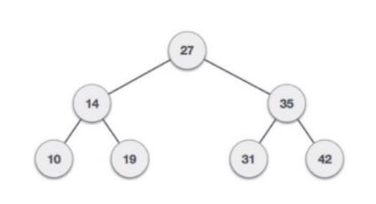

# Python - Binary tree Summation

## This program builds a binary tree, and adds the nodes from the root to the most bottom and collects the highest weight route to the lower nodes.

  
 ### STEP 1.
* Setup working environment, Header Notes/README.
I used Visual Studio Code and Python as my working environnment for this project. I then created a README file in my github account to display
and showcase my steps during the project. 

### STEP 2.
* A function to produce a new node is designed to add each of the nodes needed for the binary tree.

### STEP 3.
* Dijkstra's function is implemented to find the hightest weight from the top node to the lower nodes.

### STEP 4.
* Uility funcition is deployed to collect and add all the nodes from the longest path available.

### STEP 5. 
* The bianary tree is implemented starting from the root(top) node and then moving down in the branches to designed the requested bianry tree in the assignment.

### Result
* In this sample binary tree the route with the highest weight is 27->25->42 and once the summation (104) is complete the result is displayed in output.
